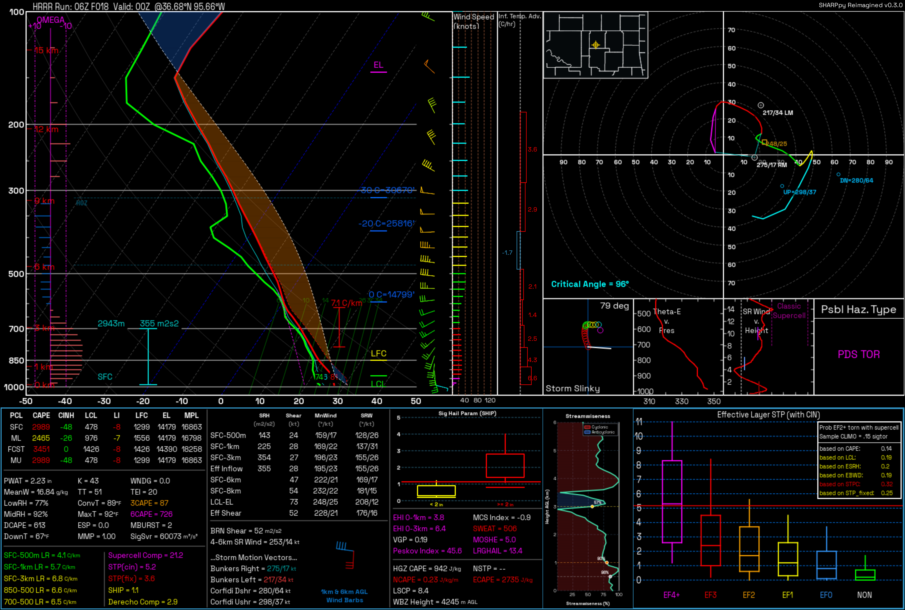

<div align="center">

# SHARPpy Reimagined vRust

**Rust-first sounding analysis and model ingest with a Qt6 SHARPpy-style desktop GUI for Python 3.11+.**

[](https://github.com/FahrenheitResearch/SHARPpy-Reimagined-vRust/actions/workflows/tests.yml)


[](LICENSE)

</div>



SHARPpy Reimagined is a modernized, standalone fork of
[SHARPpy](https://github.com/sharppy/SHARPpy), focused on packageable Python
3.11+ workflows, Qt6/PySide6 rendering, and reproducible point-sounding tools.
It keeps the familiar SPC-style skew-T, hodograph, hazard, and derived-parameter
views while adding clean command-line entry points, bundled resources, and a
test-backed decoder/extractor layer.

## v0.3.2 build targets

The v0.3.2 release packaging is configured to produce these
no-Python-required desktop artifacts:

- **Windows x64:** a single `.exe` and a portable one-folder `.zip`.
- **Linux x64:** a single executable and a portable one-folder `.tar.gz`.
- **macOS Apple Silicon and Intel:** zipped `.app` bundles.

This checkout does not claim that v0.3.2 has already been published. Check the
[GitHub Releases page](https://github.com/FahrenheitResearch/SHARPpy-Reimagined-vRust/releases)
for the tags and artifacts that are actually available; until a v0.3.2 tag is
present, build and test it from source on the target operating system.

When built, the macOS community artifacts are ad-hoc signed, not
Apple-notarized; use **Control-click → Open** the first time if Gatekeeper asks
for confirmation. On Linux, extract the locally built or published archive and
run `SHARPpy-Reimagined-vRust` (or make the single-file artifact executable
with `chmod +x` first).

## Highlights

- Hybrid forecast retrieval that uses an existing Rusty Weather `.rws` model
  hour immediately, but prefers small point/subregion downloads for a cold
  request instead of downloading an entire model hour unnecessarily.
- A one-call, GIL-free native analysis extension: `sharppyrs` supplies the
  display-analysis layer, `sharprs` supplies the sounding core and parcel/
  meteorological calculations, and `ecape-rs` supplies analytic ECAPE/NCAPE.
- Explicit compatibility fallbacks when the extension cannot load or analyze a
  profile, plus narrowly scoped Python features for data contracts the pinned
  Rust APIs do not yet expose.
- Synced upstream v0.3.1 fixes for scalar ERA5 point coordinates,
  equilibrium-level-bounded NCAPE saturation work, and Windows PyInstaller
  inclusion/runtime verification of the local `sharpmod` package.
- Headless PNG rendering for `.npz`, SPC tabular, BUFKIT, PECAN, and WRF-ARW
  text sounding inputs.
- Portable `.npz` point-sounding output from UWyo, ERA5, WRF-ARW, and public
  forecast models fetched through Herbie.
- Qt6/PySide6 compatibility shims around the upstream SHARPpy widget stack.
- Offline UWyo station catalog plus package-relative bundled fonts.
- Property-based pytest coverage for decoders, derived parameters, hazards,
  renderer-facing widgets, and extraction paths.

## Quick Start

Requires Python 3.11 or newer. Start from a repository checkout and use an
isolated environment:

```bash
git clone https://github.com/FahrenheitResearch/SHARPpy-Reimagined-vRust.git
cd SHARPpy-Reimagined-vRust
python -m venv .venv

# Windows PowerShell: .venv\Scripts\Activate.ps1
# macOS/Linux: source .venv/bin/activate

python -m pip install --upgrade pip setuptools wheel
python -m pip install ".[render]"
python -m pip install --no-deps "SHARPpy==1.4.0a5"

python -c "import sharpmod, sharppy, sutils, PySide6, qtpy; print('imports OK')"

sharpmod-render examples/soundings/hrrr_point_36.68N_95.66W_f018.npz out.png
```

The Python source install remains usable without a Rust toolchain and then uses
the complete SHARPpy-compatible Python analysis fallback. To enable the same
native analysis used by the standalone build from a source checkout, install
Rust, then build the pinned extension:

```bash
git clone https://github.com/FahrenheitResearch/sharppyrs native/sharppyrs
git -C native/sharppyrs checkout 958bcd685b1e28b8fce0ab5c7b8daea3cdd993aa
git -C native/sharppyrs apply ../patches/sharppyrs-ecape-el.patch
cargo build --manifest-path native/sharpmod-native/Cargo.toml --release --locked
python packaging/install_native_extension.py
python -c "from sharpmod import sharpmod_native; print(sharpmod_native.backend_info())"
```

`sharpmod-render` writes a 2x HD PNG by default; add `--uhd` for the larger
2.8x export or `--lossless` for the original-size compact/lossless PNG.

The upstream `SHARPpy==1.4.0a5` package is installed with `--no-deps` because
its published metadata pins an old NumPy version. SHARPpy Reimagined provides
the modern runtime dependencies separately. Contributors who intend to edit
the checkout can replace `pip install ".[render]"` with the editable form
`pip install -e ".[render]"`.

## Desktop GUI

An interactive, legacy-SHARPpy-style desktop app is included:

```bash
sharpmod-gui          # or: python -m sharpmod.gui
```

On Windows, source-checkout GUI runs use Python 3.11-3.13. If this command is
invoked by Python 3.14 and the checkout has a `.venv` or `.gribenv`, the launcher
automatically hands the GUI to that compatible environment before Qt starts.
The Windows packaging target bundles Python 3.11.

The **Sounding Picker** opens with four ways to load a sounding:

- **Station Map** — a clickable map of every UWyo radiosonde station over a
  coastline basemap. Click a dot to select, double-click to open; scroll to
  zoom, drag to pan, and pick a region from the *Map area* menu. Observation
  times are selectable every three hours from 00Z through 21Z.
- **Station List** — the full catalogue with live id/name filtering and the
  same three-hourly UTC observation-time choices.
- **Forecast Model** — click a point or enter latitude/longitude, then choose a
  public model, UTC run, forecast hour, and optional ensemble member. The picker
  checks that inventory in the background. If publication is delayed, it offers
  the newest available earlier cycle without silently changing the selection;
  an uncertain check never disables manual Fetch. The fetch runs in the
  background with stage/byte progress and a Cancel button, then opens the point
  sounding only after its display calculations are ready. Once the first model
  sounding is open, a single click on another map point fetches that point and
  refreshes the same interactive plot instead of opening another window. For a
  Rust-supported selection, **Cache This Hour for Fast Map Browsing** builds a
  reusable full-hour `.rws` store in the background with progress and cancel
  support.
- **Open File** — a local `.npz`, SPC, BUFKIT, PECAN, or WRF-ARW text sounding
  (or just drag the file onto the window).

Each sounding opens in the full interactive SPC window (the upstream SHARPpy
widget stack), so every interaction from the
[SHARPpy GUI guide](https://sharppy.github.io/SHARPpy/interacting_gui.html)
works:

- **Right-click the Skew-T** for the readout cursor, *Modify Surface*, parcel
  lifting, and reset.
- **Click + drag** temperature / dewpoint / wind points to edit the profile —
  every index recalculates live.
- **Mouse wheel** zooms; **right-click the hodograph** re-centers it, and
  **double-clicking** the RM/LM markers sets the storm motion.
- **Double-click the lower-left inset** to swap lifted parcels.
- **Keys:** ← / → step in time, ↑ / ↓ change ensemble member, `Space` swaps
  focus, `I` interpolates, `C` collects observed, `W` returns to the picker.
- **Undo / Redo:** `Ctrl+Z` reverses profile, interpolation, and storm-motion
  edits; `Ctrl+Y` reapplies them. Each viewer retains the latest 50 edits.
- **File → Preferences** switches the color palette (Standard / Inverted /
  Protanopia), units, and the parcel visualized by default when a Skew-T opens.

GUI choices persist across launches, including temperature/wind/PWAT units,
palette, top/bottom readouts, default parcel, multi-sounding behavior, dismissed
tips, recent files, and last selections. On Windows they are stored in
`%APPDATA%\SHARPpy Reimagined\settings.ini`; set `SHARPMOD_SETTINGS_PATH` to
use a different INI file.

### Rust-first sounding analysis

When `sharpmod_native` is present, decoded soundings target a compatible native
profile adapter. One GIL-free call normalizes the profile and computes the
parcels, thermodynamic fields, kinematics, severe-weather composites, fire and
winter diagnostics, watch inputs, and the complete 84-field `sharppyrs`
derived set through `sharppyrs` and its `sharprs` core. Interactive user-parcel
lifts use `sharprs` too. The authoritative vRust ECAPE/NCAPE values come from
the in-process `ecape-rs` path.

The extension returns the versioned `sharpmod.native-analysis.v1` schema and
records per-result provenance (`sharprs-core`, `sharppyrs-rust`, and
`ecape-rs`). `backend_info()` also exposes the exact pinned `sharppyrs`,
`sharprs`, and `ecape-rs` revisions used to build it.

Python remains intentional for four inputs the pinned Rust interface does not
currently own: detailed fire-PBL fields, precipitation-source/layer-energy
analysis, SARS analog databases, and station PWV climatology. The Rust
precipitation-type and watch classifiers consume those results when available.
If the extension is missing, disabled, rejects the profile, or fails at
runtime, the app constructs the full legacy-compatible Python
`ConvectiveProfile` instead. Set `SHARPMOD_DISABLE_NATIVE_ANALYSIS=1` to test
that fallback explicitly.

Representative development timings for the bundled 39-level HRRR sample are
below. They were measured with a release-mode extension on one Windows
development machine after import warm-up, so they are reference ranges rather
than hardware or network guarantees.

| Operation | Observed time |
| --- | ---: |
| Bulk Rust analysis call | 1.4–1.9 ms |
| Interactive Rust user-parcel lift | 0.72–0.85 ms |
| Compatible profile, including the four Python-only feature groups | 39–48 ms |
| `.npz` load + native profile + display companion | 40–52 ms |
| Full legacy Python `ConvectiveProfile` on the same sample | 227–231 ms |

Model transport is a separate cost. On the same development setup, an existing
`.rws` hour exported another point in 39–49 ms; an uncached HRRR Zarr point took
2.6–3.5 seconds and about 12.3 MB; and the deliberate cold Rust full-hour path
took about 43.5 seconds and roughly 500 MB. Network conditions and model-hour
size dominate those retrieval numbers.

### Analysis sessions

Use **File → Save Analysis Session…** (`Ctrl+Shift+E`) in a sounding window to
save every loaded sounding, the active profile, current profile/interpolation/
storm-motion edits, parcel selection, and viewer state. **Open Analysis
Session…** (`Ctrl+Shift+O`) is available from both the picker and sounding
window and restores the saved soundings together in one viewer.

Session files use the `.sharpmod-session` extension and a versioned, portable
JSON format; they do not execute code or embed source GRIB downloads. Forecast
download directories still follow the normal lifecycle and are deleted when
their original viewer closes.

### Export

The sounding window's **Export** menu saves the current view:

- **Export Image (HD PNG)** (`Ctrl+E`) — a 2x high-density image of the full
  window, including the mounted derived-parameter panels, with a sensible
  default filename (`STATION_YYYYMMDDHHZ_hd.png`) in your Desktop folder.
- **Export Image (UHD PNG)** — a larger 2.8x ultra-high-density image
  (`STATION_YYYYMMDDHHZ_uhd.png`).
- **Export Image (Lossless PNG)** — the original-size compact/lossless image
  for smaller files (`STATION_YYYYMMDDHHZ_lossless.png`).
- **Copy Image to Clipboard** (`Ctrl+Shift+C`) — the same current view, ready
  to paste into another app.
- **Export Text (SHARPpy)** — the focused profile as a text file that loads
  back into the app.

(The upstream `File → Save Image` / `Save Text` actions remain available too.)

### Standalone application

A one-folder, no-Python-required build is produced with PyInstaller:

```bash
python -m pip install pyinstaller
pyinstaller packaging/sharpmod_gui.spec --noconfirm
```

The result is `dist/SHARPpy-Reimagined-vRust/` on Windows/Linux and a
`dist/SHARPpy-Reimagined-vRust.app` bundle on macOS. Set
`SHARPMOD_ONEFILE=1` on Windows or Linux for a single self-extracting
executable instead. PyInstaller outputs are platform-specific, so each build
must be created on its target operating system.

## Command Line Tools

| Command | Purpose |
| --- | --- |
| `sharpmod-render` | Render a sounding file to a PNG |
| `uwyo-sounding` | List, search, and fetch University of Wyoming soundings |
| `era5-extract` | Extract an ERA5 point sounding to `.npz` |
| `model-extract` | Fetch all pressure levels for a supported forecast-model point sounding |
| `wrf-extract` | Extract a WRF-ARW point sounding to `.npz` |

### Forecast-model extraction (`model-extract`)

Install the GRIB stack before fetching model data. Add the render stack and the
upstream SHARPpy runtime when `--render` is needed:

```bash
# Extraction only
python -m pip install -e ".[era5]"

# Extraction plus PNG rendering
python -m pip install -e ".[era5,render]"
python -m pip install --no-deps "SHARPpy==1.4.0a5"
```

Discover the installed CLI and check remote inventory before a large fetch:

```bash
model-extract --help
model-extract --list
model-extract gfs --probe --fxx 0

# Also download and open the pressure-level subset during the probe
model-extract gfs --probe --fxx 0 --open-subset
```

Fetch a point sounding by model key, latitude, and longitude:

```bash
# Keep the portable .npz and its .json metadata sidecar
model-extract gfs 35.18 -97.44 gfs_oun.npz --fxx 0 --loc "Norman, OK"

# Select an exact UTC cycle and forecast hour
model-extract gfs 35.18 -97.44 gfs_oun_f006.npz --run "2026-07-14 00:00" --fxx 6

# Render to a named PNG; fetched GRIB/.npz/.json data is removed afterward
model-extract hrrr 35.18 -97.44 --fxx 0 --render hrrr_oun.png

# Omit the PNG name to use the generated point-sounding filename stem
model-extract hrrr 35.18 -97.44 --fxx 0 --render

# Select an ensemble member (GEFS defaults to c00)
model-extract gefs 35.18 -97.44 gefs_p01.npz --fxx 0 --member p01
```

If `--run` is omitted, the CLI chooses the most recent configured cycle at or
before the current UTC time; upstream publication can lag that cycle, so use
`--probe` or pass an earlier `--run` when inventory is not available. Without
`--render`, the `.npz` and `.json` outputs remain. With `--render`, only the PNG
remains. The GUI instead retains fetched files until the sounding window closes.

#### Download acceleration and cache

The extractor keeps every pressure level published by the selected model while
avoiding fields that are duplicates for sounding construction. It tries the
smallest compatible route first:

1. For HRRR, GFS, and RRFS-A, an exact model hour already present in the bundled
   Rusty Weather `.rws` store is exported directly.
2. An uncached HRRR F000 analysis uses direct point reads from the public HRRR
   Zarr archive when available.
3. Other cold requests use either a small NOAA NOMADS geographic subset or
   validated, coalesced HTTP byte ranges from a healthy indexed provider. The
   planner chooses between them from the model inventory and expected size.
4. Any unavailable or incompatible optimization falls back to Herbie's
   standard downloader.
5. In automatic mode, if those Python point/subregion routes all fail for a
   Rust-supported model, Rusty Weather makes a final full-hour ingest attempt.

That last cold Rust path deliberately downloads and processes a complete model
hour, which can mean hundreds of megabytes rather than a point-sized subset. It
is therefore a late fallback in `auto` mode, but its durable `.rws` result makes
later points from the same model/run/hour very inexpensive. Set
`SHARPMOD_MODEL_BACKEND=rust` when that full-hour cache-building tradeoff is
intentional; set it to `python` to disable all Rust model acquisition.

For repeated map browsing, select a supported model/run/forecast hour and click
**Cache This Hour for Fast Map Browsing**. The independent background worker
builds the durable `.rws` hour without opening a dummy sounding, reports
progress, supports cancellation, and removes the source GRIB after the store is
successfully written (unless raw-GRIB retention is explicitly enabled). Later
map clicks for that exact hour use the fast cached exporter.

The GUI keeps downloaded model hours under
`%LOCALAPPDATA%\sharpmod\model-cache` on Windows (or the platform cache folder),
up to 3 GB and 48 hours by default. In the File menu, **Prefetch Next Forecast
Hour** optionally warms the next valid hour, **Clear Downloaded Model Cache**
removes retained entries, and the model tab's **Cancel** button stops the active
request. Verified partial files from compatible range downloads are retained so
the same request can resume.

Advanced overrides are available for testing or constrained environments:

| Environment variable | Default | Effect |
| --- | --- | --- |
| `SHARPMOD_MODEL_BACKEND` | `auto` | `auto` uses cached Rust first and cold Rust last; `rust` forces native full-hour ingest; `python` disables Rust |
| `SHARPMOD_HRRR_BACKEND` | `auto` | `auto`, `zarr`, or `grib` for HRRR F000 |
| `SHARPMOD_POINT_BACKENDS` | `auto` | Set to `grib` to bypass point/subregion routes |
| `SHARPMOD_PROVIDER_RACING` | `1` | Set to `0` to disable equivalent-provider probes |
| `SHARPMOD_MODEL_CACHE` | platform cache | Override the GUI model-cache directory |
| `SHARPMOD_MODEL_CACHE_GB` | `3` | Maximum retained cache size in GiB |
| `SHARPMOD_MODEL_CACHE_HOURS` | `48` | Maximum retained entry age |
| `SHARPMOD_RUSTY_WEATHER_CACHE` | platform cache | Override the Rust `.rws` store directory |
| `SHARPMOD_RUST_CACHE_GB` | `4` | Maximum retained Rust store size in GiB |

#### Configured models

These are the canonical keys accepted by this checkout. `model-extract --list`
is the runtime source of truth and also reports known models that are not
enabled. Remote run availability still depends on the upstream provider.

| Canonical key | Model / product | Coverage | Configured forecast hours | Aliases / notes |
| --- | --- | --- | --- | --- |
| `hrrr` | HRRR pressure levels | CONUS | 00/06/12/18Z: F000-F048 hourly; other cycles: F000-F018 hourly | — |
| `rap` | RAP 13 km AWIPS pressure levels | CONUS | F000-F051 hourly | — |
| `nam` | NAM 12 km pressure levels | CONUS | F000-F084 every 3 hours | — |
| `nam-3km-conus` | NAM 3 km CONUS nest | CONUS | F000-F060 hourly | `nam3`, `nam-3km` |
| `hrw-wrf-arw` | NOAA HiResW WRF-ARW 5 km | CONUS | F000-F048 hourly | `hiresw-arw`, `hrw-arw` |
| `hrw-fv3` | NOAA HiResW FV3 5 km | CONUS | F000-F048 hourly | `hiresw-fv3` |
| `rrfs-a` | RRFS-A 3 km pressure levels | CONUS | F000-F060 hourly | `rrfs` |
| `gfs` | GFS 0.25-degree pressure levels | Global | F000-F120 hourly, then every 3 hours to F384 | — |
| `aigfs` | AI-GFS pressure levels | Global | F000-F384 every 6 hours | Humidity is read from specific humidity |
| `cfs` | CFS 6-hourly pressure levels | Global | F000-F384 every 6 hours | Member 1 by default |
| `ecmwf-ifs` | ECMWF IFS Open Data | Global | F000-F144 every 3 hours, then every 6 hours to F360 | `ecmwf`, `ifs` |
| `ecmwf-aifs` | ECMWF-AIFS Open Data | Global | F000-F144 every 3 hours, then every 6 hours to F360 | `aifs` |
| `gefs` | GEFS 0.5-degree pressure levels | Global | F000-F384 every 3 hours | Control member `c00` by default |

```bash
# Observed sounding: fetch Norman, OK at 00Z and render it
uwyo-sounding fetch 72357 "2024-05-20 00" --out oun.npz --render oun.png

# Render the mixed-layer parcel on the Skew-T (MU is the default)
sharpmod-render oun.npz oun_ml.png --parcel ML

# Reanalysis / local WRF point soundings
era5-extract "2024-05-20 00:00" 35.18 -97.44 era5.npz --render
wrf-extract wrfout_d01_2024-05-20_00:00:00 35.18 -97.44 wrf.npz --render
```

`era5-extract` retrieves all 37 pressure levels from the official Copernicus
Climate Data Store API. Create a free CDS account, accept the ERA5 dataset
licence, and copy the credentials shown on the
[CDS API setup page](https://cds.climate.copernicus.eu/how-to-api) into
`$HOME/.cdsapirc` before the first request. Public forecast models continue to
use Herbie and do not require CDS credentials.

`sharpmod-render --parcel` accepts `SFC`, `ML`, `FCST`, `MU`, `EFF`, and
`USER`. Parcel keys are case-insensitive.

## Install Extras

| Extra | Installs | Use it for |
| --- | --- | --- |
| `[render]` | SHARPpy runtime companions | PNG rendering |
| `[era5]` | CDS API, Herbie, cfgrib, ecCodes, xarray, numcodecs, pyproj | ERA5 and public forecast-model point extraction |
| `[wrf]` | xarray, netCDF4 | WRF-ARW NetCDF extraction |
| `[dev]` | pytest, Hypothesis | Test and development work |

```bash
python -m pip install -e ".[dev,era5,wrf,render]"
python -m pip install --no-deps "SHARPpy==1.4.0a5"
pytest
```

For the full setup reference, see [`installation.txt`](installation.txt). For
usage recipes and Python API examples, see [`docs/USAGE.md`](docs/USAGE.md).

## Data Flow

```text
UWyo / ERA5 / WRF ------------------------------+
                                                |
forecast model                                  |
  |                                             |
  +-> existing Rust .rws cache                  |
  +-> optimized point/subregion -> Herbie       |
  +-> cold Rust full-hour fallback              |
                 |                              |
                 +----> portable .npz sounding <+
                                   |
                                   +-> interactive SPC window
                                   +-> sharpmod-render -> PNG
```

## Repository Map

```text
sharpmod/
  gui.py        interactive desktop app (sounding picker + SPC window)
  render.py     headless PNG render entry point
  sharptab/     derived-parameter and meteorological calculations
  io/           decoders for SPC, BUFKIT, PECAN, WRF-ARW, .npz, and UWyo
  viz/          Qt6/PySide6 rendering widgets
  tools/        UWyo, ERA5, forecast-model, WRF, basemap, and render CLI tools
  resources/    bundled fonts, station catalog, GUI assets, and Rust helpers
  tests/        unit, smoke, and property-based tests

packaging/
  sharpmod_gui.spec   PyInstaller spec for the standalone GUI build

examples/
  example_sounding.png
  soundings/    bundled sample inputs

docs/
  USAGE.md      workflow guide and API examples
```

## Attribution

This project builds on the abandoned upstream
[SHARPpy](https://github.com/sharppy/SHARPpy) project. See [`LICENSE`](LICENSE)
for license terms and attribution. This is an independent fork and is not
endorsed by the upstream SHARPpy or MetPy contributors. The optional model
backend is built from
[Rusty Weather](https://github.com/FahrenheitResearch/rusty-weather) under its
MIT license. The native analysis extension integrates
[sharppyrs](https://github.com/FahrenheitResearch/sharppyrs), its
[sharprs](https://github.com/FahrenheitResearch/sharprs) core, and
[ecape-rs](https://github.com/FahrenheitResearch/ecape-rs); see the pinned
source repositories and bundled third-party notices for their license terms.
